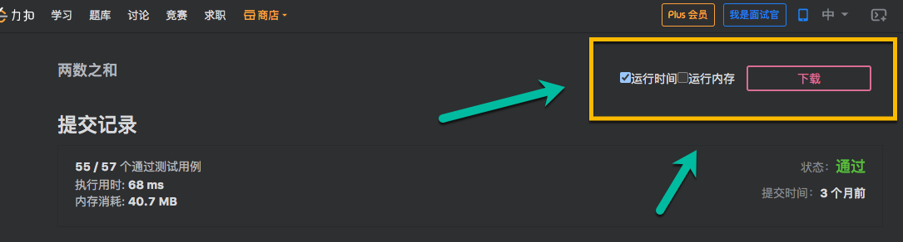
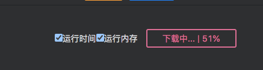

# 力扣扩展

> 注意: 我不确定力扣官方对于爬取提交记录中的代码的行为是怎样的态度,所以提醒一下,使用此扩展最好是使用小号进行,以避免影响正常账号的使用.
>
> 默认所有使用此扩展的,人均已了解其中的风险.所有因使用此扩展而产生的问题,本人概不负责,也与本人无关!

## 安装使用

需要先在浏览器里安装 [Tampermonkey](https://www.tampermonkey.net/) 或者 [Violentmonkey](https://violentmonkey.github.io/) 扩展,然后打开使用下面其中一个链接安装:

- [GitHub 链接](https://github.com/XYShaoKang/leetcode-extend/raw/master/dist/main.user.js)
- 如果访问不了 GitHub 可以使用这个 [FastGit 链接](https://hub.fastgit.org/XYShaoKang/leetcode-extend/raw/master/dist/main.user.js)

## 功能

- [提交记录下载](#提交记录下载)

### 提交记录下载

> 支持下载国服和外服在提交记录页面,下载时间分布图和内存分布图中的代码,保存到一个 Markdown 文件

安装好之后,进入力扣的提交记录页面(选择一个题目 -> 提交记录 -> 点击提交结果列中的链接),右上角能看到如下按钮

> 外服也在同样的位置



按钮左边可以选择下载哪些代码,分布图里的代码,或者内存分布图里面的代码,或者两个都选,然后点击选择,可以下载

点击下载之后,会显示下载进度



> 在频繁调用之后,会返回`429 Too Many Requests`的错误,这时需要等一下,再去请求.这个 API 容忍度好像比较低,需要等的久一些,测试过比较久的每次需要等一分钟左右才能再次成功请求,所以如果发现进度停住了,不要着急,耐心等一下,如果需要下载的数量比较多的时候,挂着过几分钟在回来看看.
>
> 比如两数之和这题 TypeScript 的代码总共有 405 个,下载完成总共花了 6 分钟

## 开发

首先需要安装 [Tampermonkey](https://www.tampermonkey.net/) 或者 [Violentmonkey](https://violentmonkey.github.io/) 扩展

以及 [Node.js](https://nodejs.org/en/download/)(>=v14)

### 下载

```sh
git clone https://github.com/XYShaoKang/leetcode-extend.git
cd leetcode-extend
```

### 安装依赖

包管理工具,我推荐使用的是 [pnpm](https://pnpm.io/),不过使用 `yarn` 和 `npm` 也可以

```sh
pnpm install # 或者 yarn 或者 npm install
```

### 运行

```sh
pnpm dev # 或者 yarn dev 或者 npm run dev
```

然后打开 http://localhost:9000/ ,应该会自动跳转到安装脚本的界面.

> 另外记得如果有安装了正式版的脚本,需要先把正式版的关掉,不然会出现两个按钮

### 热加载

开发模式下,我已经配置好了[热加载](https://webpack.js.org/concepts/hot-module-replacement/),在开发模式下运行,每次源码的修改,会实时反应到页面中,非常方便

### 编译

```sh
pnpm build # 或者 yarn build 或者 npm run build
```

编译好之后,会在 dist 文件夹下生成 `main.user.js` 文件,可以直接拖到浏览器中安装
