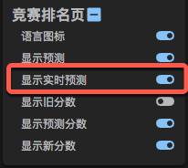

# 竞赛排名页

## 显示预测

- 2022-02-24 完成初始版本
- 2022-11-27 更新预测数据源

此功能源码 [src/content/pages/ranking](../src/content/pages/ranking)

目前预测数据 API 已经切换至 https://lccn.lbao.site/，欢迎大家到作者的仓库中 https://github.com/baoliay2008/lccn_predictor 点点 Star

> ~~效果如下,预测数据来自 https://lcpredictor.herokuapp.com/~~
>
> https://lcpredictor.herokuapp.com/ 目前在[迁移](https://github.com/SysSn13/leetcode-rating-predictor/issues/48)，旧的 API 已经失效，新的 API 未知，无法获取数据。

## 竞赛排名页面显示代码对应的语言图标

- 2022-03-09 完成初始版本

此功能源码 [src/content/pages/ranking/FileIcon.tsx](../src/content/pages/ranking/FileIcon.tsx)

在排名页列表中的提交时间前面,将之前代码图标替换为提交所使用的语言对应的图标,这样可以很直观的看到选手提交所使用的语言

这样如果我只想看某种语言的提交,就不需要一个个点进去看,可以节省很多时间

> 由于世界服 API 返回的数据没有对应提交的语言标记,所以目前只支持国服的排名页

演示

https://user-images.githubusercontent.com/38753204/212783934-2383f4a5-caf5-4997-b166-c13a6996ddd6.mp4

## 实时预测

- 2023-03-18 添加

在客户端根据选手的得分和完成时间实时计算预测分数，计算时会消耗一定的性能，所以最好是在有需要时在开启。可以在配置选项中控制功能的开关。

另外实时预测会存在一定的误差，计算结果仅供参考。

为了跟榜单预测进行区分，实时预测外侧会添加一个虚线框。

演示

https://user-images.githubusercontent.com/38753204/226372446-6861c5e7-4a23-4a57-a1c6-3314229ed29c.mp4

### 预测算法说明

预测算法源码：[src/content/utils/predict.ts](../src/content/utils/predict.ts)

- 因为无法区分 0 分选手属于未参赛，还是有提交但 WA 掉的，所以对于这部分选手进行特殊处理。目前采用的策略是直接过滤这部分选手。虽然这会造成一开始 AK 的选手预测结果误差较大，但随着比赛时间慢慢进行，这个误差也会慢慢缩小。
- 对于相同分数并且相同完成时间的选手排名计算，首先会计算有多少选手是比这个分数和时间更快，然后在此基础上加 1，所以相同分数和相同完成时间的选手，会有一样的排名。
- 为了提高性能，会先预处理 `[0,8000]` 范围内的 ERank，预测是只需要在这个范围内二分查找对应的 ERank 即可。
- 但如果按照正常的算法去预处理 ERank 大概需要 5s 以上，虽然预处理后就可以重复使用，但第一次打开页面时的体验很不好。这个问题通过使用 FFT 来加速预处理 ERank 得到解决，使用 FFT 加速之后，预处理 ERank 就只需要 100ms~200ms 左右，速度非常快。

> FFT 加速的思路来自于 [Carrot](https://github.com/meooow25/carrot)，但其实我一开始是看不懂的，好在经过 [@tiger2005](https://leetcode.cn/u/u/tiger2005/) 大佬的讲解并实现了代码，我了解了如何使用，并在项目中实际用上 FFT 加速，从而提升了预测算法的性能。同时非常感谢 [@tiger2005](https://leetcode.cn/u/u/tiger2005/) 大佬，在预测算法的优化过程中，提供的指导和反馈。
>
> 以上测试的时间，均来自于我本地的测试结果。
