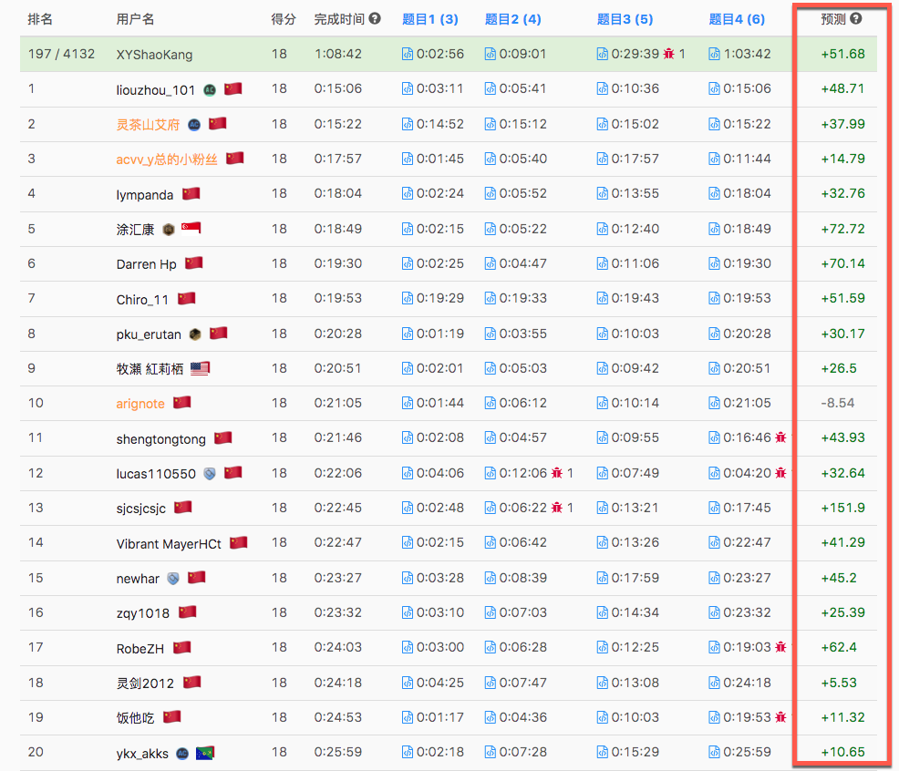
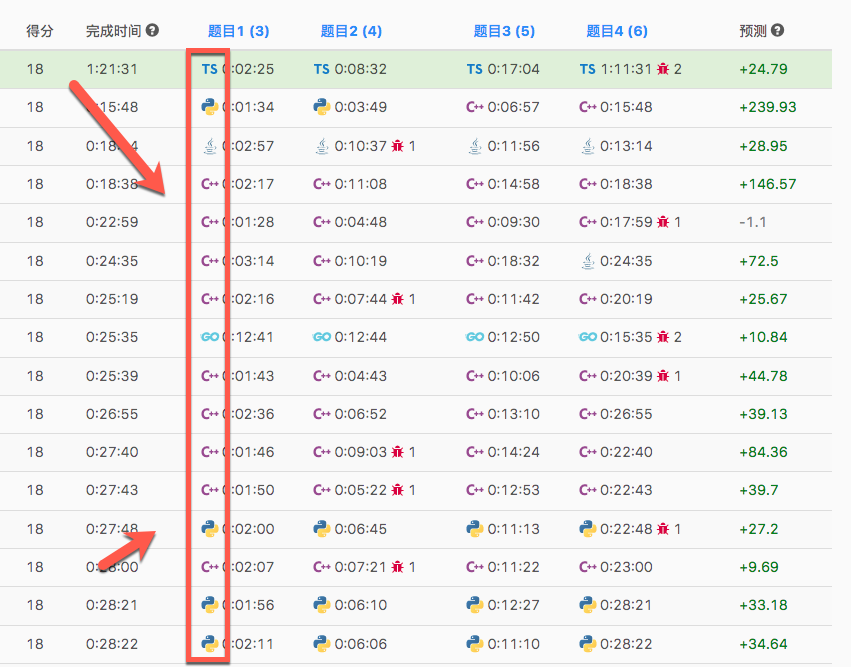

# 竞赛排名页

## 显示预测

- 2022-02-24 完成初始版本
- 2022-11-27 更新预测数据源

此功能源码 [src/content/pages/ranking](../src/content/pages/ranking)

目前预测数据 API 已经切换至 https://lccn.lbao.site/，欢迎大家到作者的仓库中 https://github.com/baoliay2008/lccn_predictor 点点 Star

> ~~效果如下,预测数据来自 https://lcpredictor.herokuapp.com/~~
>
> https://lcpredictor.herokuapp.com/ 目前在[迁移](https://github.com/SysSn13/leetcode-rating-predictor/issues/48)，旧的 API 已经失效，新的 API 未知，无法获取数据。

## 竞赛排名页面显示代码对应的语言图标

- 2022-03-09 完成初始版本

此功能源码 [src/content/pages/ranking/FileIcon.tsx](../src/content/pages/ranking/FileIcon.tsx)

在排名页列表中的提交时间前面,将之前代码图标替换为提交所使用的语言对应的图标,这样可以很直观的看到选手提交所使用的语言

这样如果我只想看某种语言的提交,就不需要一个个点进去看,可以节省很多时间

> 由于世界服 API 返回的数据没有对应提交的语言标记,所以目前只支持国服的排名页

演示

https://user-images.githubusercontent.com/38753204/212783934-2383f4a5-caf5-4997-b166-c13a6996ddd6.mp4

## 实时预测

- 2023-03-18 添加

在客户端根据选手的得分和完成时间实时计算预测分数，计算时会消耗一定的性能，所以最好是在有需要时在开启。另外实时预测会存在一定的误差，计算结果仅供参考。

为了跟榜单预测进行区分，实时预测外侧会添加一个虚线框。

演示

https://user-images.githubusercontent.com/38753204/226001214-de41e971-c4a1-47e6-b9b1-f6eab7ca364c.mp4
