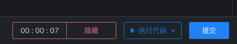
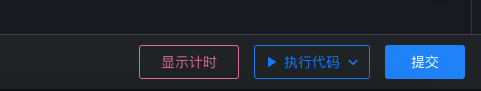
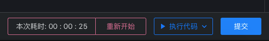
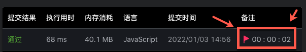

# 答题页

- 2022-01-02 完成初始版本
- 2022-01-03 自动添加标记的功能
- 2022-10-22 适配力扣新版 UI
- 2022-11-1 添加随机一题按钮
- 2022-11-1 阻止保存页面的弹窗

此功能源码 [src/content/pages/problems](../src/content/pages/problems/)

## 计时器

> 此功能的最初创意由 https://leetcode-cn.com/u/s192516/ 提出

进入答题页时,自动开始计时,第一次提交成功之后会停止计时,并显示所用时间

计时器位于页面右下角,提交和执行代码按钮的左边.

目前提供三种操作,分别是在计时阶段:

提供隐藏时钟的操作

重新显示时钟的操作

以及在结束之后,重新开始的操作

计时器操作演示

https://user-images.githubusercontent.com/38753204/212781557-bcfbeb61-d7ff-413f-922a-da65db24bb85.mp4

## 自动添加标记的功能

当成功提交之后,会将当前所有时间自动添加到对应提交的标记中

新版答题页演示

https://user-images.githubusercontent.com/38753204/212781261-a6b6a367-8773-49ca-85a5-cef4738a0a73.mp4

## 随机一题按钮

`随机一题`按钮位于上方导航栏处，跟`上一题`、`下一题`等按钮放在一块，在随机刷题的计划中，不用每次都返回题库页去点击`随机一题`。

## 比赛答题页提供快捷键禁用选项

比赛的时候，直接在网页写题的时候，经常会发生按到某个快捷键的情况，比如像 Cmd+S 会触发页面保存，当然这个只要按下取消就好了，但如果是不小心按到提交的快捷键，则会造成罚时，导致比赛失利。

所以我添加了一个禁用快捷键的选项，启用后会禁止触发这些快捷键，防止意外发生。

## 比赛答题页自定义布局

来自 [https://github.com/acfinity](https://github.com/acfinity) 的贡献

将布局切换成横向布局，更加贴近平常刷题的界面，以及更加容易一遍看题目一遍写代码。另外还支持拖动改变题目和编辑框的宽度。

