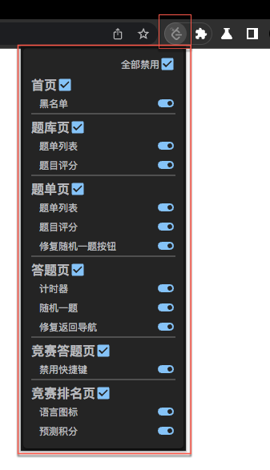
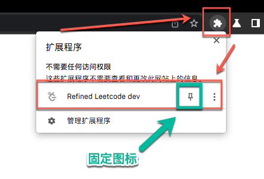

# 配置选项

- 2022-01-31 完成初始版本

通过配置选项，去控制扩展各个功能的开关。安装后启用扩展，可以通过左键点击浏览器右上角的扩展图标，在弹出的窗口中进行配置。或者是右键点击扩展图标，在点击选项，会打开一个网页，可以在其中进行配置。

新版本的 Chrome 默认会隐藏扩展图标，可以通过点击拼图图标，在其中找到扩展图标进行操作。另外可以通过点击固定图标，将扩展图标固定显示出来。

