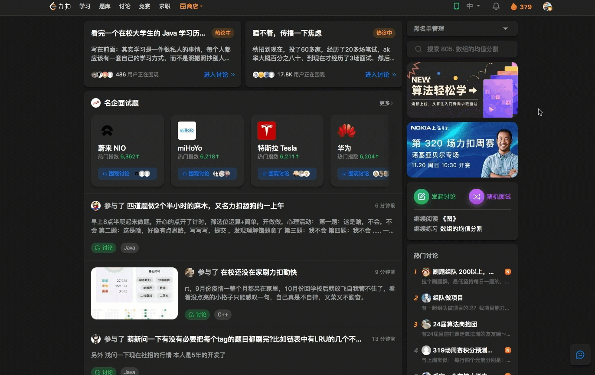
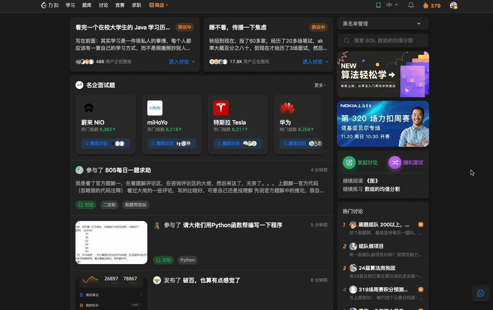
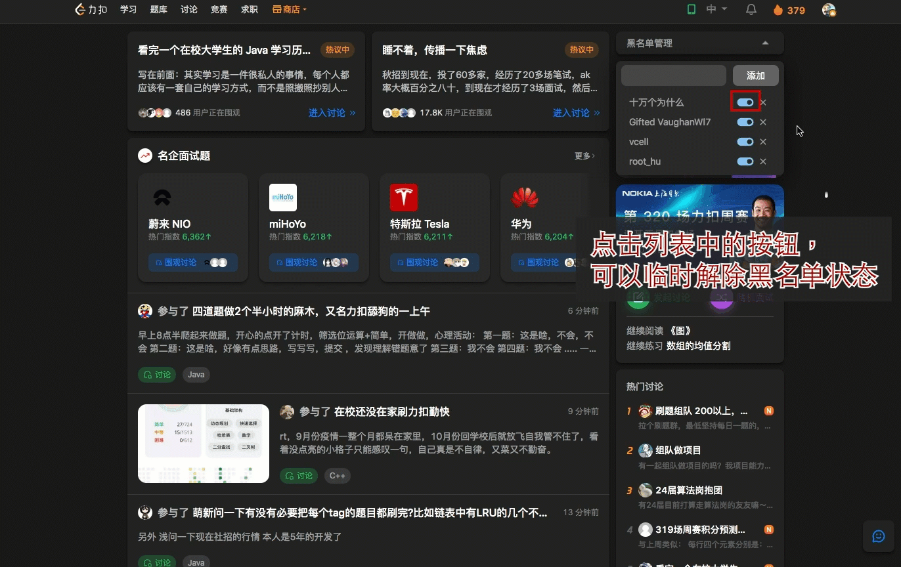

# 首页帖子黑名单

- 2022-10-21 完成初始版本
- 2022-11-14 更新添加黑名单的快捷方式

此功能源码 [src/content/pages/home](../src/content/pages/home)

通过添加黑名单用户，可以阻止该用户的帖子在首页显示。黑名单数据只存储在本地，如果有多个地方使用的话，则需要在对应的浏览器上添加黑名单。目前只支持首页的帖子中过滤掉黑名单用户发的帖子。

安装扩展之后，会在首页右边栏最上方出现一栏黑名单管理的组件，点击可以对当前黑名单列表进行添加和删除等管理。

## 打开黑名单列表

## 手动输入 slug 添加黑名单

如果要将某个用户添加到黑名单中，需要输入其 slug，可以从其个人主页获取，一般会出现在昵称的下面，或者是个人主页 url 的最后一段。

## 通过添加拖拽手柄添加

## 通过拖拽链接添加

## 临时解除黑名单

## 删除黑名单

